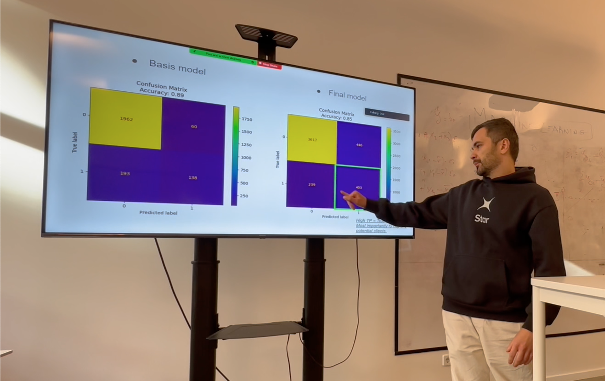

# Financial inclusion in Africa 
 Find a notebook where I demonstrate the way I created different machine learning models to predict which individuals are most likely to have or use a bank account. The models and solutions developed can provide insights into some of the key factors driving individuals’ financial security.

The evaluation metric for this project is Mean Absolute error, where 1 indicates that the individual does have a bank account and 0 indicates that they do not.


---




Description of project workflow: 

1)Define client's case
2)Import data and perform exploratory analysis
3)Feature engineering
4)Build potential customers' profile
5)Hypothesis generation
6)Feature engineering
7)Training and comparing different machine learning models


## Requirements and Environment

Requirements:
- pyenv with Python: 3.11.3

Environment: 

For installing the virtual environment you can either use the Makefile and run `make setup` or install it manually with the following commands: 

```Bash
pyenv local 3.11.3
python -m venv .venv
source .venv/bin/activate
pip install --upgrade pip
pip install -r requirements.txt
```

## Usage

In order to train the model and store test data in the data folder and the model in models run:

```bash
#activate env
source .venv/bin/activate

python example_files/train.py  
```

In order to test that predict works on a test set you created run:

```bash
python example_files/predict.py models/linear_regression_model.sav data/X_test.csv data/y_test.csv
```


